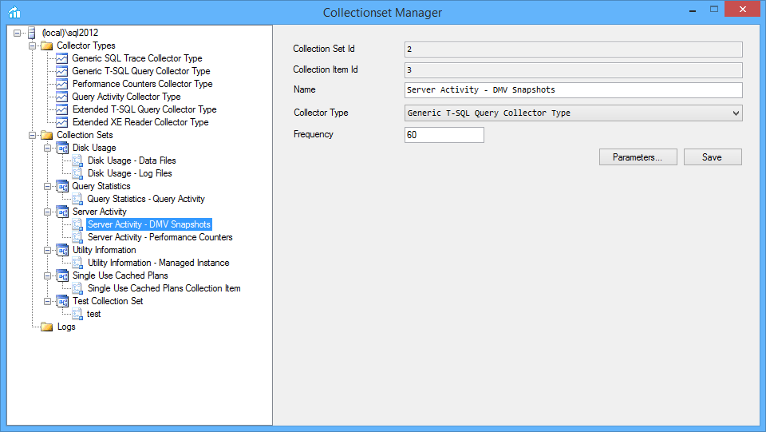
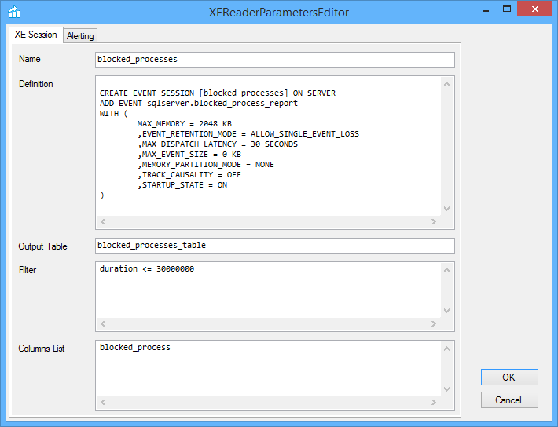
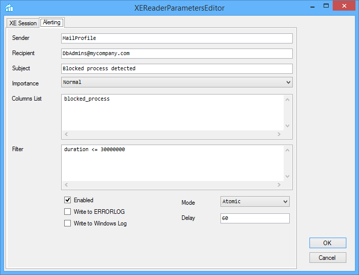
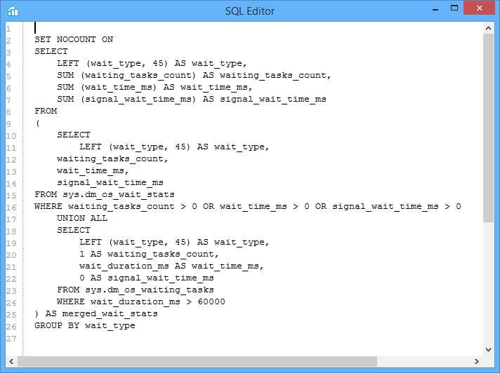

# Extended T-SQL Collector
_ Custom collector types to extend and simplify the features offered by the built-in SQL Server Data Collector and read data from Extended Events and/or queries. _

**Extended T-SQL Collector = Extended Events + Data Collector**

**Extended T-SQL Collector** includes a XEReader collector type that lets you collect data from Extended Events sessions. This is the easiest way around to save Extended Events to a table.

SQL Server ships with a built-in T-SQL Collector Type that lets you collect data based on an custom T-SQL statement. However, it doesn't let you collect data in **any** fomat: you are limited to the data types accepted by the intermediate format used to store the cache files (SSIS Raw Files, which do not allow BLOB data).

To overcome this limitation, **Extended T-SQL Collector** offers a T-SQL query collector type that uses a different cache format and lets you collect XML and varchar(max)/nvarchar(max) columns.

When it comes to performance tuning and troubleshooting, the most interesting data is available in SQL Server as XML. With this collector type, you can easily collect and upload XML data to your MDW instance.

The Collection Set Manager utility lets you manage:
* installation of the collector type to the target SQL Server instance
* edit collection sets 
* edit collection items
* edit collector types

Here are some screenshots of the GUI:

**Connection:**

**Collector Type Editor:**

**Collection Set Editor:**

**Collection Item Editor:**

**TSQL Parameters Editor:**

**XEReader Parameters Editor:**

**SQL Editor:**

**XML Editor for Collector Type Parameter Schema and Formatter and for Collection Items parameters:**

**Browse the collected data:**

Collection sets and collection items can also be created via script. You can find examples in the documentation.

# Features

* ExtendedTSQLCollector - a Collector Type that lets you collect BLOB data from a T-SQL query
* ExtendedXEReaderCollector - a Collector Type to collect data directly from an Extended Events session
* ConnectionSetManager - a GUI utility to manage the components of data collection  on a target instance

# Requirements

* SSIS - the target machine must have SSIS installed, as some collection packages require tasks not included in the Database Engine installation
